# MxDev Swiss Tool

The **MxDev Swiss Tool** is an offline-first, all-in-one developer toolkit designed specifically for Mendix developers. It runs entirely locally in your browser to guarantee 100% data privacy—ensuring you never have to paste sensitive client logs, database queries, or authorization tokens into public web utilities.

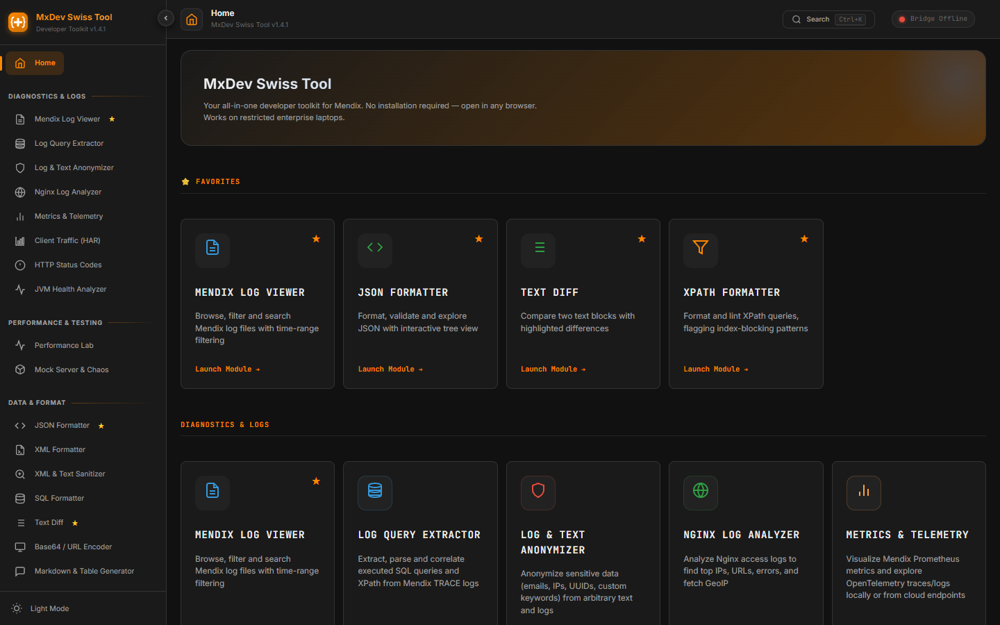

---

## ⚡ Quick Start

1. **Download** the latest `MxDevSwissTool-Release-*.zip` from the [Releases page](https://github.com/RealMecowhy/MxDevSwissTool/releases/latest) — it's listed under **Assets** (don't use the "Source code" links).
2. **Extract** the ZIP to any folder — Desktop or Documents is fine, no admin rights needed.
3. **Run** `Start-MxDevSwissTool.bat` (double-click). The tool opens automatically in your default browser.

No Node.js installed? No problem — the launcher offers to download a portable one for you. If Windows shows a security warning on first launch, choose **More info → Run anyway**. Details and alternatives in [How to Run the Application](#-how-to-run-the-application).

---

## 🛠️ Included Tools & Features

The toolkit is divided into logical categories to assist you across the entire development and diagnostic lifecycle:

### 1. Diagnostics & Logs
* **Mendix Log Viewer**: Tail, search, and filter Mendix logs with time-range filtering, error aggregation, and interactive Sequence/Gantt chart visualization. Reads both Mendix Cloud live logs (`.txt`/`.log`/`.gz`) and Studio Pro CSV exports. An **Insights** tab turns a raw log into a triage board: it scans for known Mendix problem patterns — permission violations, request-state (session) bloat, TaskQueue failures with retry-loop detection, and per-node error hotspots — and shows one card per issue that actually occurs (never an empty report), each clickable to filter the stream. A **Levels Matrix** tab pivots the whole log by log node × severity — one glance shows which logger is producing the errors (nodes are ranked by error volume) and which nodes are running at DEBUG/TRACE; every cell filters the stream to those entries. **Line bookmarks** (the ☆ on any row) pin the key moments of an incident into a bar that survives every filter change — click one to jump straight back, even if the current filter would hide it. It works on ordinary production logs (INFO level and up); no DEBUG/TRACE required.
  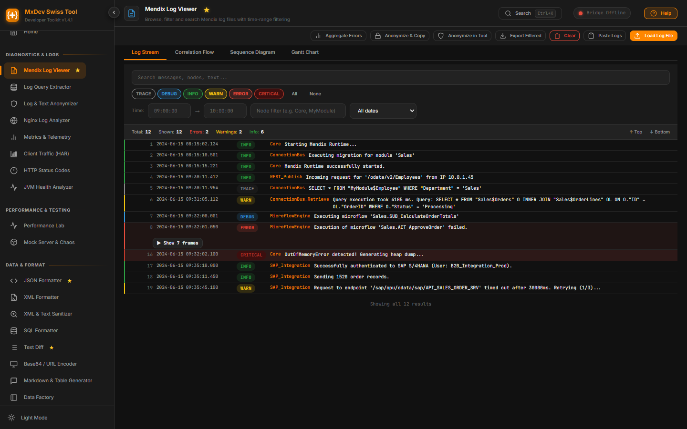
  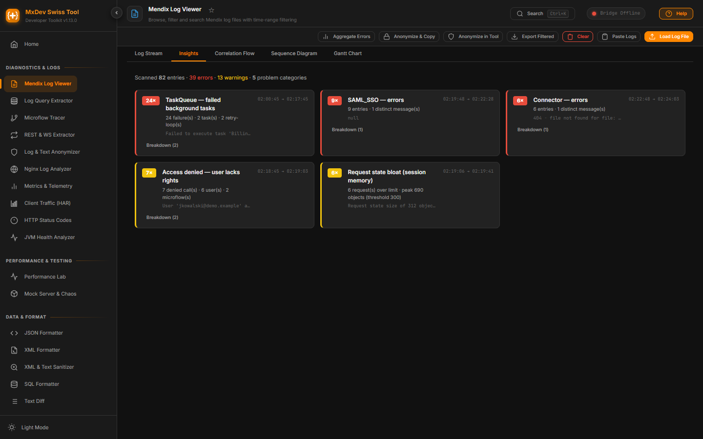
  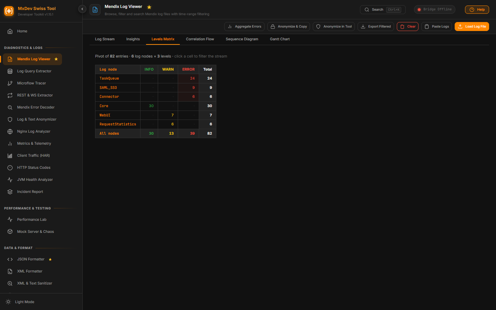
* **Log & Text Anonymizer**: Automatically strip sensitive PII (emails, IPs, UUIDs, custom keywords) from logs before sharing them with support.
* **Log Query Extractor**: Extract, parse, and correlate executed SQL, OQL, and XPath queries from Mendix TRACE logs, complete with parameter binding. Live filter stats (total/avg/slowest time, duplicates), a "Slow only > X ms" filter, and CSV/Markdown export of the filtered list. Also ingests slow-query warnings (`ConnectionBus_Queries`) that Mendix logs at default levels — a production performance signal with zero configuration, picked up from CSV exports and Cloud live logs alike. A shared, single-pass parser reads both formats and runs off the main thread (Web Worker) so even 100 MB+ TRACE logs load without freezing the UI. **Optional live EXPLAIN**: if you have a local/dev PostgreSQL database of the app, connect the read-only *Live database* panel and run `EXPLAIN` on a selected `SELECT` straight from the Query Plan tab — the fresh plan opens in the SQL Explain visualizer. Fully optional and read-only (single `SELECT`, no `ANALYZE`, `READ ONLY` transaction with a statement timeout); without a connection everything works exactly as before.
  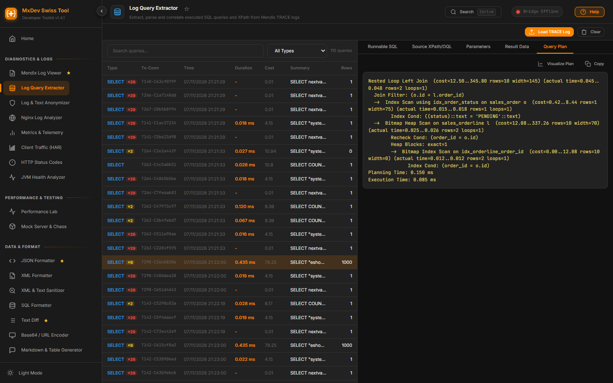
* **Microflow Tracer**: Rebuild microflow executions from `MicroflowEngine` logs — exact durations from DEBUG records, activity-by-activity timelines and sub-microflow call trees from TRACE. Aggregate per-microflow view (calls / total / avg / max) finds hot paths in seconds, recursion gets flagged, and a "Queries in window" jump opens the Log Query Extractor filtered to the SQL that ran inside the selected execution — one log file powers both tools. An **N+1 detector** flags the classic anti-pattern — a database retrieve firing once per row inside a `ListLoop`, whether directly or via a called sub-microflow — with a badge, a stat and a timeline banner naming the repeated retrieve. A **Background** view separates the work the runtime starts on its own (scheduled events, task-queue workers — the runtime gives them a UUID correlation ID, requests get a numeric one) and aggregates it per event: runs, median/max duration, the median interval between starts, a first-half-vs-second-half duration trend, and a flag for runs that **overlapped** a still-open previous run. When the log has no `MicroflowEngine` records at all it falls back to the background failures the log does carry instead of showing an empty table. Reads Studio Pro CSV exports and Mendix Cloud live logs; a real 69 MB production log parses in ~2 s without freezing the UI.
  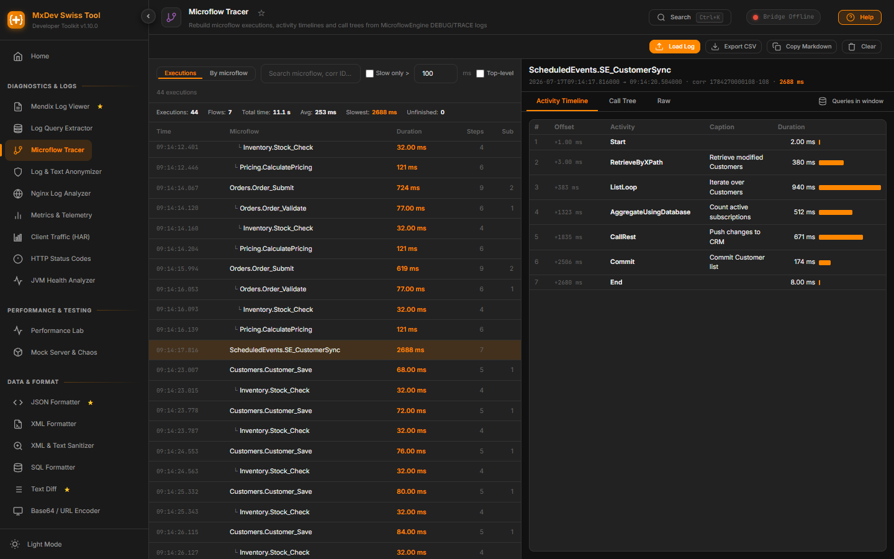
* **REST & WS Extractor**: Rebuild complete integration calls from `REST Consume`, `REST Publish` and `WebServices` TRACE logs — requests paired with their responses (FIFO per endpoint, with an explicit "uncertain" flag when two calls to the same endpoint overlap in flight), including method, URL, status, headers, payloads (auto-prettified JSON/XML) and wire-time duration from timestamp deltas. Detects requests that never got a response and marks client-timeout suspects using the logged HTTP-client timeout. With `MicroflowEngine` TRACE present, each outgoing call is anchored to the microflow that made it — "Trace microflow" and "SQL in window" cross-links close the full **microflow → REST → SQL** chain across three tools from a single log file.
  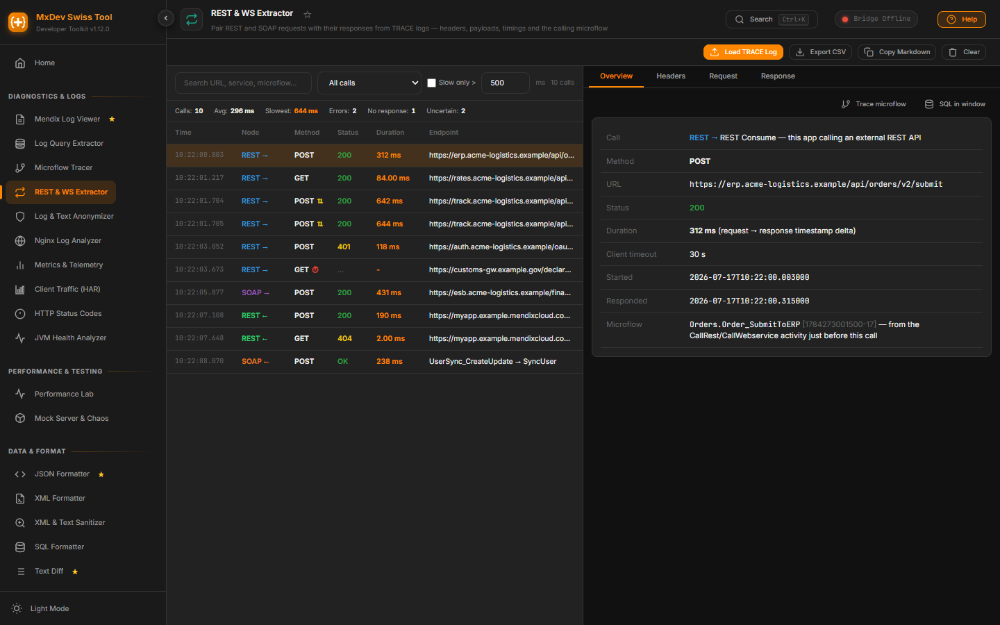
* **Mendix Error Decoder**: Paste a Mendix, Java or PostgreSQL error message or stack trace and get the **mechanism** behind it — decoded, not guessed. For every known signature it matches (unique/foreign-key/not-null constraints, deadlocks, statement timeouts, connection-pool exhaustion, heap/metaspace/GC/thread OOMs, TLS trust failures, socket timeouts, SAML audience/clock-skew, and more) it shows three things: *what happened technically* (certain), *typical causes* (an explicit list of hypotheses) and *how to check which one applies* (a diagnostic checklist that links straight to the Log Query Extractor, JVM Health Analyzer and Microflow Tracer). It is a decoder, not a fix advisor: it always shows the pattern it matched so you can judge the fit, and when it does not recognize a message it says so rather than inventing a cause. ERROR rows in the Log Viewer carry an **Explain** chip that sends the full message here in one click.
  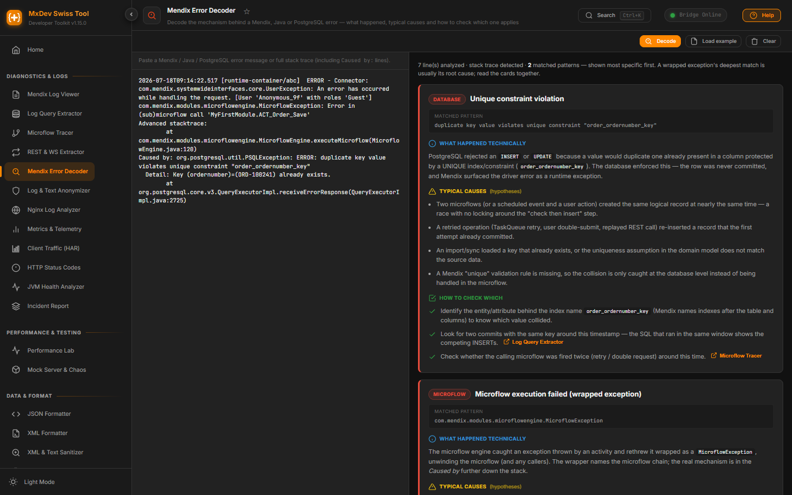
* **Nginx Log Analyzer**: Analyze access logs to identify top IPs, request paths, status codes, and response times, with optional IP geolocation mapping. The slowest-URLs table reports **p95 / p99** latency per endpoint alongside the average, so a slow tail stops hiding behind a healthy mean, and a **"SQL in window"** link on access-log rows jumps to the Log Query Extractor scoped to that request's time window.
  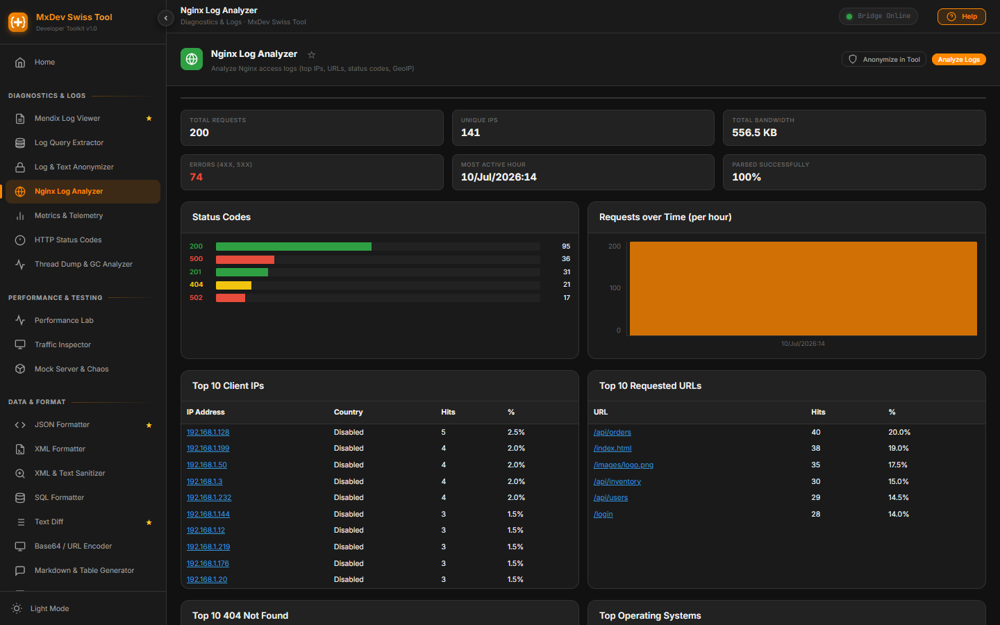
* **Client Traffic Analyzer (HAR)**: Decode a browser HAR into named Mendix client operations (microflows, XPath retrieves) to spot client-side N+1 patterns, chatty microflows, and oversized responses that raw DevTools can't surface.
  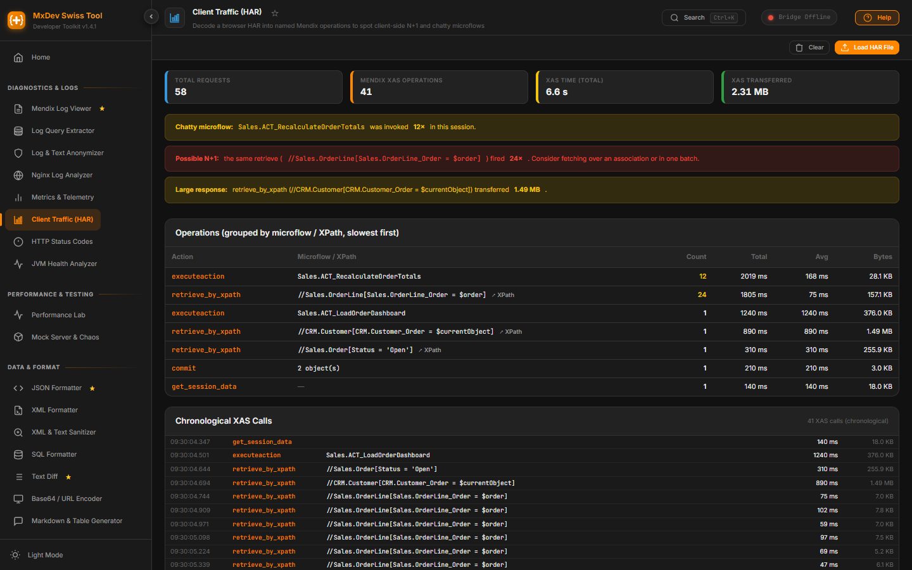
* **Metrics & Telemetry**: Visualize Mendix Prometheus metrics (heap, threads, request rate, database queries) as live dashboards and explore OpenTelemetry traces/logs, locally or from cloud endpoints. Set **threshold alerts** on heap, threads or the database pool to catch a leak or pool exhaustion as it builds. Includes a sandbox mode for exploring without a running app.
  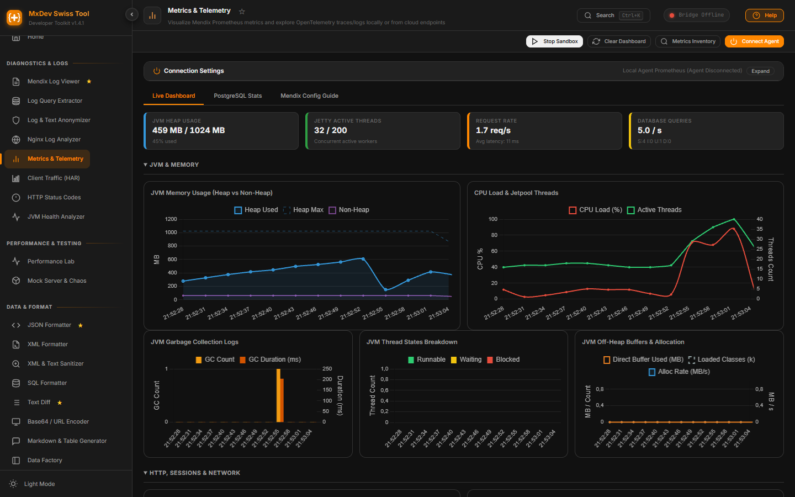
* **JVM Health Analyzer**: Analyze JVM thread dumps, garbage collector logs, and heap histograms to locate blocked threads, diagnose GC pauses, and spot memory leaks.
  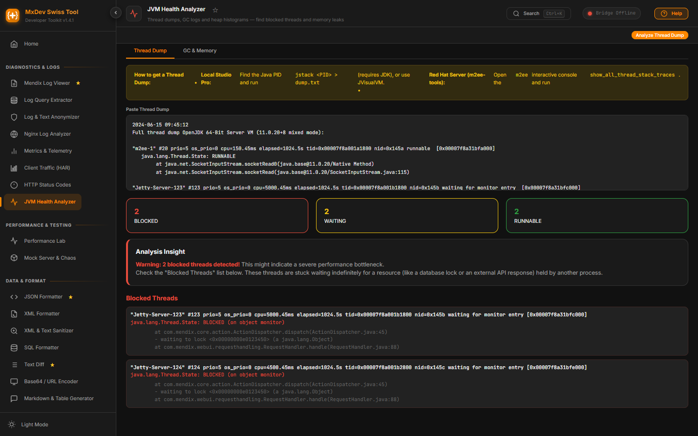
* **Incident Report**: Combine the data already loaded across the diagnostics tools — Log Viewer warnings & errors, Log Query Extractor SQL, Microflow Tracer executions, REST & WS Extractor calls, Nginx requests and the JVM Health thread-dump summary — into **one self-contained HTML report** for a chosen time window. Because every section is filtered to the same window, a spike lines up across the Nginx 5xx responses, the slow SQL, the failing microflow and the blocked threads in a single file that is safe to attach to a ticket (no external resources). Data-driven: only sources that hold data are offered, and a section appears only when it produced rows.
  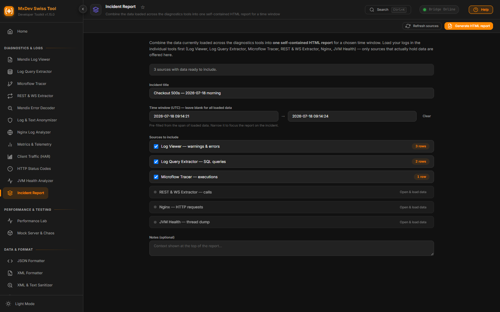
* **HTTP Status Codes**: A searchable status code reference with Mendix-specific context.

### 2. Performance & Testing
* **Performance Lab**: Simulate concurrent load on Mendix HTTP/REST endpoints with real-time latency tracking and statistics (min/avg/max and p50/p95/p99 percentiles).
* **Mock Server & Chaos Engineering**: Simulate external REST endpoints with configurable mock responses, artificial latency, and injected connection errors (5xx, timeouts).
  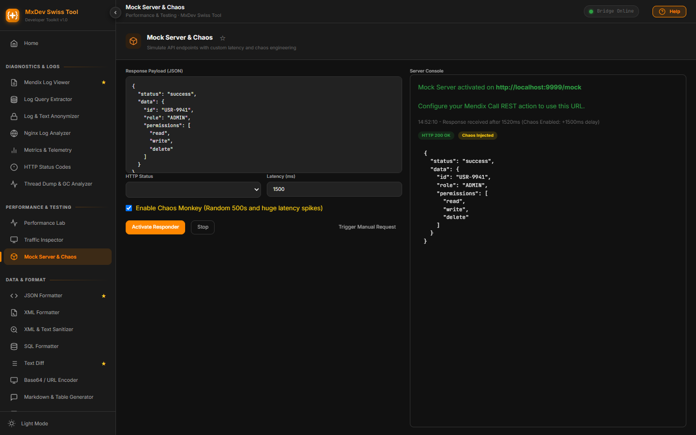
* **Data Factory**: A high-volume mock data generator (JSON/CSV/XML) to generate realistic test data based on configurable schemas. The schema can also be **imported instead of typed** — paste a `CREATE TABLE` script (PostgreSQL, SQL Server or Oracle; nothing is executed, only the column list is read), or, with an optional read-only connection, pick an entity straight from `mendixsystem$entity` / `$attribute` so the mock data matches the entity you are importing into. Field names come across verbatim and the generator for each field is inferred from its name and type — `EmailAddress` becomes an e-mail, `Price` a decimal — with a name hint accepted only when it fits the column's type, so `city_id` stays an integer instead of being filled with "London". Every inference is listed with its reason so you can correct it, and binary columns are excluded rather than filled with random bytes that would break the import.
  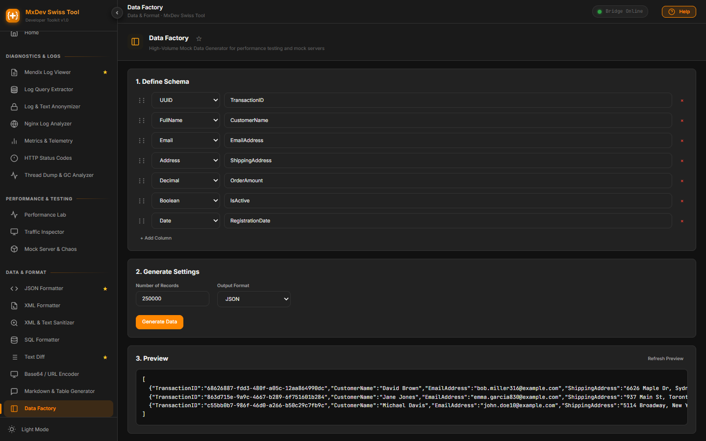

### 3. Data & Formatting
* **JSON / XML Formatters**: Format, validate, and explore payloads with interactive tree views.
  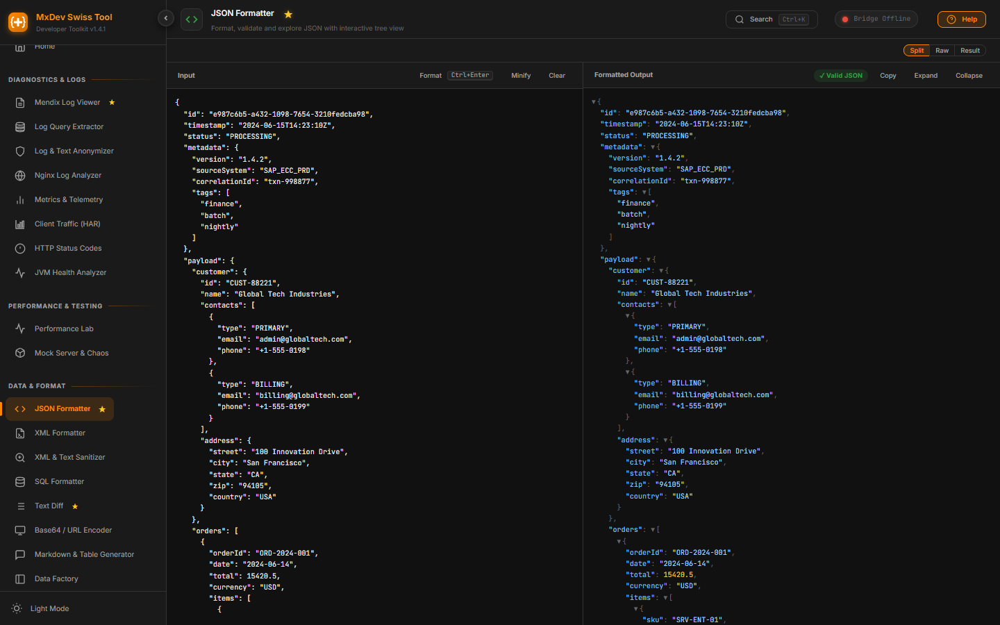
* **SQL Formatter**: Format and highlight complex ORM-generated database queries.
* **Base64 / URL Encoder**: Encode and decode strings and HTML entities locally.
* **XML & Text Sanitizer**: Detect and clean hidden control characters, zero-width spaces, Mojibake, escaped references to invalid XML 1.0 characters (like `&#14;`), and invisible Private Use Area codepoints.
* **XPath Formatter (Linter)**: Format Mendix XPath constraints and lint them for index-blocking patterns before they hit the database.
  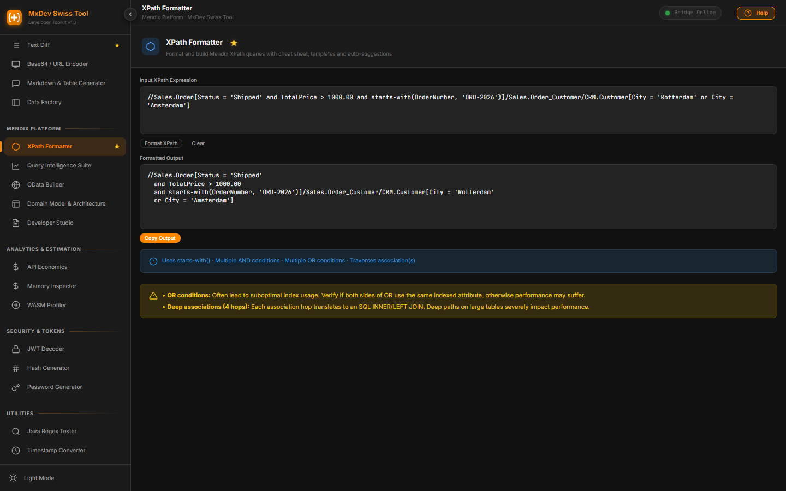
* **Text Diff**: Compare two text blocks or code side-by-side with differences highlighted.
  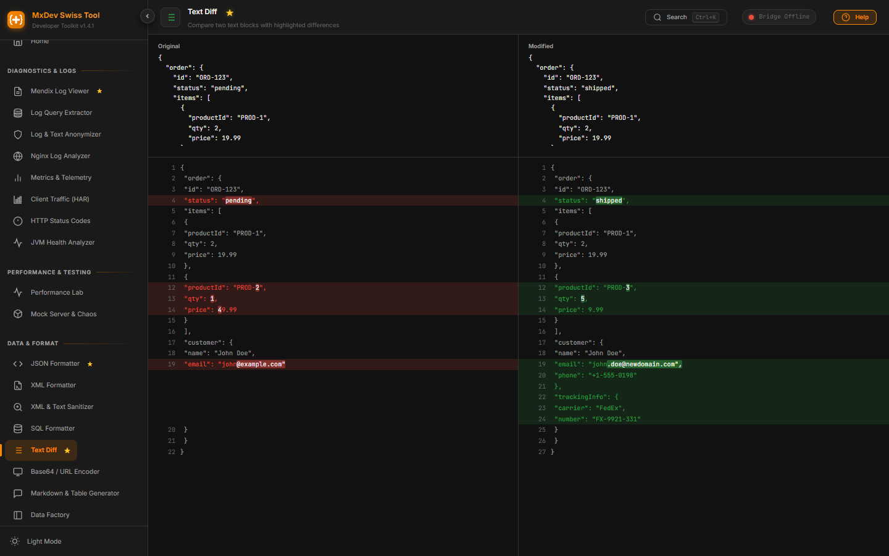
* **Markdown Editor & Table Generator**: Write module documentation with a live HTML preview — drop a `.md` file straight onto the editor to load it. The table generator turns a range pasted from Excel, Google Sheets, or a CSV into a ready Markdown table, with per-column alignment and no hand-typed pipes.
* **Excel Converter**: Turn an `.xlsx` workbook — the whole file or one selected sheet — into JSON or CSV, without the Excel → *Save As CSV* → fix-the-separator-and-encoding round trip. Reads the workbook in the browser with no library at all (an `.xlsx` is a ZIP of XML, unpacked with the browser's own `DecompressionStream`), so nothing is uploaded. Every sheet is listed with its row and column counts, hidden sheets included and marked. Output is JSON as an array of objects (first row becomes the keys), JSON as raw rows, or CSV with a choice of delimiter — pick the semicolon for a Polish or German Excel, where a comma-separated file otherwise opens as one mashed column — and a UTF-8 BOM that is on by default, because without it Excel mangles every accented character. Dates are read rather than guessed: Excel stores them as plain numbers and only the cell format makes them dates, so the tool reads the format table and emits ISO 8601 (with a switch to keep the raw serial number). Formulas arrive as their last calculated value, merged ranges keep the value in the top-left cell and say how many ranges a sheet has, blank header cells become their column letter and duplicate headers get a numbered suffix rather than silently overwriting each other. The legacy binary `.xls` format is not supported and is named as such, with the fix, instead of failing as a parse error.
  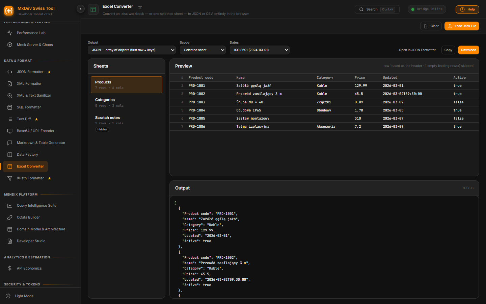

### 4. Mendix Platform Utilities
* **Query Intelligence Suite**: A consolidated query workbench — OQL formatter, OQL ↔ SQL translator, PostgreSQL EXPLAIN plan visualizer with index suggestions (paste a plan, or optionally run EXPLAIN live against a connected read-only local/dev database), a schema visualizer that draws entities and associations from an OQL query, and an **Index Advisor** that reads the catalogs of a connected database to report duplicate, redundant, invalid and never-scanned indexes plus tables dominated by sequential scans. The advisor is careful about what statistics can actually prove: index usage counters restart at zero on a restored dump, so when the window is too thin it says so and withholds the usage findings instead of telling you to drop 600 healthy indexes — structural findings, read from the catalog shape, hold either way. Findings for Mendix-managed tables note that indexes declared on an entity are recreated on every deploy, so the real change belongs in Studio Pro rather than in SQL.
  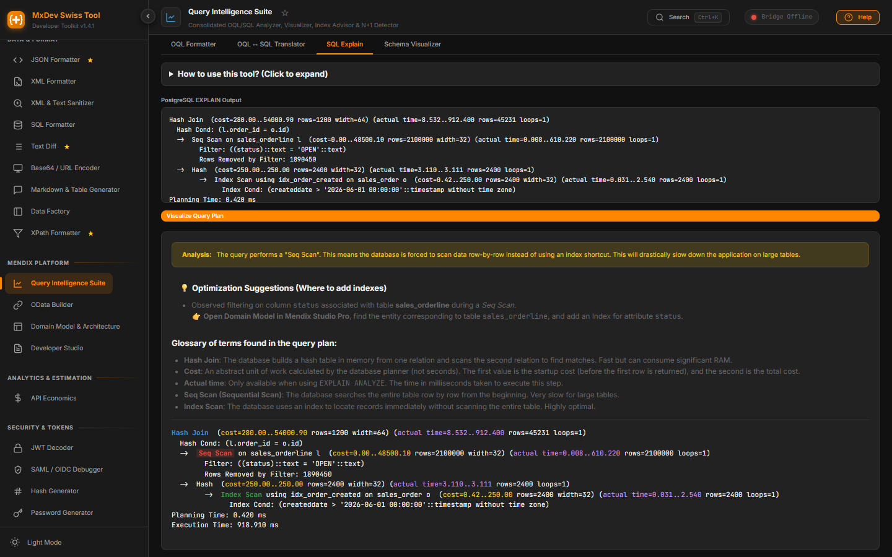
* **OData Query Builder**: Build correct OData v3/v4 queries for Published OData Services without hand-crafting URLs.
* **Domain Model & Architecture Visualizer**: Generate Mermaid.js class diagrams from Domain Model JSON schemas or pseudocode — or **load the domain model straight from a running Mendix database** (optional, read-only). Mendix keeps its own model metadata in `mendixsystem$entity` / `$attribute` / `$association`, so the database can describe entities, attributes, inheritance and associations without Studio Pro or the `.mpr` file, on both Mendix 9 and 11. Association cardinality is read from real `UNIQUE` indexes rather than assumed, so 1-1 is distinguished from 1-* and *-* from 1-*. Because a real application is unreadable as a single diagram, you pick which modules to draw. Without a database the tool behaves exactly as before.
* **Developer Studio**: A dashboard for your locally running Studio Pro project via the Observability Bridge — configuration, user roles, request handlers, scheduled events, constants, and client bundle size.
* **API Economics**: Analyze JSON payloads to cut response size and spot redundant fields.

### 5. Security & Utilities
* **JWT Decoder**: Inspect JWT tokens securely without transmitting them externally.
  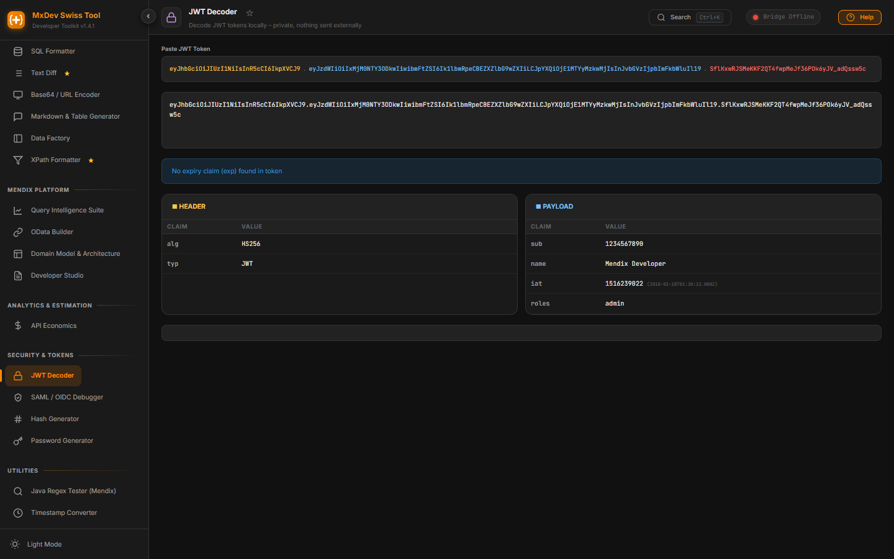
* **SAML / OIDC Debugger**: Decode SAML responses/requests (Base64, URL-encoded or DEFLATE-compressed) and OIDC id_tokens locally to debug SSO integrations — inspect assertions, claims, and validity windows without pasting tokens online.
  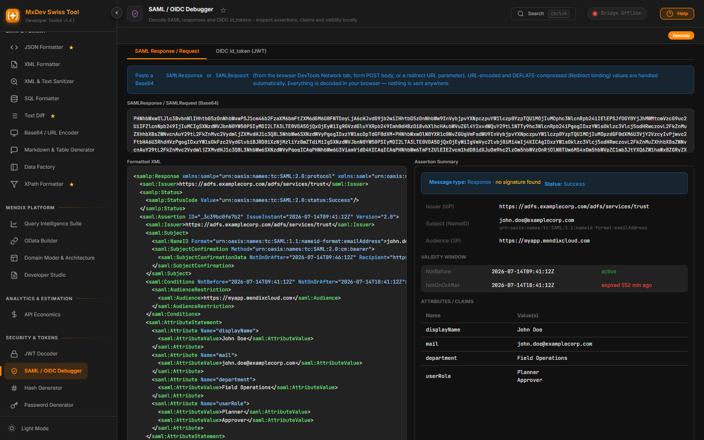
* **Hash / Password Generators**: Generate strong passwords and cryptographic hashes (SHA-256, SHA-512) locally.
* **Java Regex Tester (Mendix)**: Evaluate regular expressions against the Java regex engine — exactly how Mendix validates them at runtime.
* **Timestamp Converter**: Convert between Unix epochs, ISO 8601, and local timezone formats.

---

## 🧭 Getting Around

* **Welcome tour**: on the very first launch a short onboarding modal introduces the essentials below; reopen it anytime via the **Welcome tour** button on the Home screen.
* **Built-in help**: every tool has a **Help** button in the top bar explaining what it does and, where relevant, how to extract the input data (e.g. a HAR from browser DevTools or TRACE logs from Mendix).
* **Favorites**: click the ☆ star next to a tool's name (or on its Home card) to pin it to the top of the Home screen.
* **Command palette**: press **Ctrl+K** to jump to any tool by name, or run a global **action** — *Export current view* and *Load file into…* act on whichever tool is active.
* **Data Hub — load a log once, use it everywhere**: the four log tools (Log Viewer, Log Query Extractor, Microflow Tracer, REST & WS Extractor) share whatever file you last loaded. A bar above the view reports *Loaded: file · N records · format* and offers **Open in…** buttons for the other three — one click hands the same file over instead of dragging a 60 MB log into each tool in turn, and a ✓ marks the ones that already have it. It is also the only route for a gzipped `.gz` Cloud download: the Log Viewer unpacks it and shares the decompressed text with tools that cannot read `.gz` themselves. Nothing is loaded? Then no bar appears at all.

---

## 🔒 Data Privacy First

This application is built with a strict **local-first** philosophy:
* All formatters, generators, decoders, and parsers execute completely within your browser.
* No data is uploaded to external servers.
* The local Node.js bridge server only acts as a read-only reader for local log files and database details on your machine.

---

## 🚀 How to Run the Application

**First time here?** Download and extract the release ZIP first — see [Quick Start](#-quick-start) at the top.

### 1. Default (Recommended)
Simply double-click the `Start-MxDevSwissTool.bat` file in the project root directory. This starts the local bridge server and automatically launches the tool UI in your default browser.

**No Node.js on your machine?** Not a problem — the launcher detects it and offers to download a portable `node.exe` (official nodejs.org binary, ~90 MB) into a `runtime` folder next to the launcher. No installation and **no admin rights** required, which makes it work on locked-down corporate laptops. If a proxy blocks the download, the launcher prints a short manual fallback: save [node.exe](https://nodejs.org/dist/latest-v24.x/win-x64/node.exe) into the `runtime` folder yourself.

### 2. Manual Command Line
If running `.bat` files is blocked by security policies in your corporate environment (requires Node.js available on `PATH`):
1. Open a terminal in the project directory.
2. Start the bridge server using Node.js:
   ```bash
   npm start
   ```
   *Alternatively, if npm is not configured, run directly:*
   ```bash
   node server/mendix-observability-bridge.js
   ```
3. Open your browser and navigate to: [http://localhost:9999/](http://localhost:9999/)

### 3. Optional: Live PostgreSQL Metrics
The bridge itself starts with **zero npm dependencies** — no `npm install` needed. Only the live PostgreSQL metrics feature requires the `pg` module. To enable it, run this once in the project directory and restart the bridge:
```bash
npm install pg
```
Everything else works without it.

---

## 🔄 Updating

Shortly after startup the tool checks [GitHub Releases](https://github.com/RealMecowhy/MxDevSwissTool/releases) for a newer version (a single anonymous API call; silent when offline or blocked by a proxy). When one exists, a popup shows the release notes of everything you missed and offers two paths:

* **Update now** — the bridge downloads the release ZIP, unpacks it, replaces its own files via a small updater window and restarts. The UI reloads automatically on the new version.
* **Download ZIP** — manual fallback for locked-down machines: grab the ZIP and unpack it over the tool folder, then start the launcher again.

You can also snooze the reminder for a day or skip a version entirely.

**Your local data is safe either way:** favorites, presets and theme live in your browser's storage (not in the tool folder), and the update never touches the `runtime/` folder with portable Node.js.

---

## 📁 Directory Structure

* [public/](file:///c:/Users/mikol/Documents/Antigravity_Projects/MendixTools/public) - Web frontend application interface (HTML, CSS, JS).
* [server/](file:///c:/Users/mikol/Documents/Antigravity_Projects/MendixTools/server) - Local Node.js bridge server (`mendix-observability-bridge.js`).
* [scripts/](file:///c:/Users/mikol/Documents/Antigravity_Projects/MendixTools/scripts) - Build and maintain utility scripts.
* `Start-MxDevSwissTool.bat` - Quick launch script for Windows. Creates an optional `runtime/` folder if you let it download portable Node.js.
