# MxDev Swiss Tool

The **MxDev Swiss Tool** is an offline-first, all-in-one developer toolkit designed specifically for Mendix developers. It runs entirely locally in your browser to guarantee 100% data privacy—ensuring you never have to paste sensitive client logs, database queries, or authorization tokens into public web utilities.

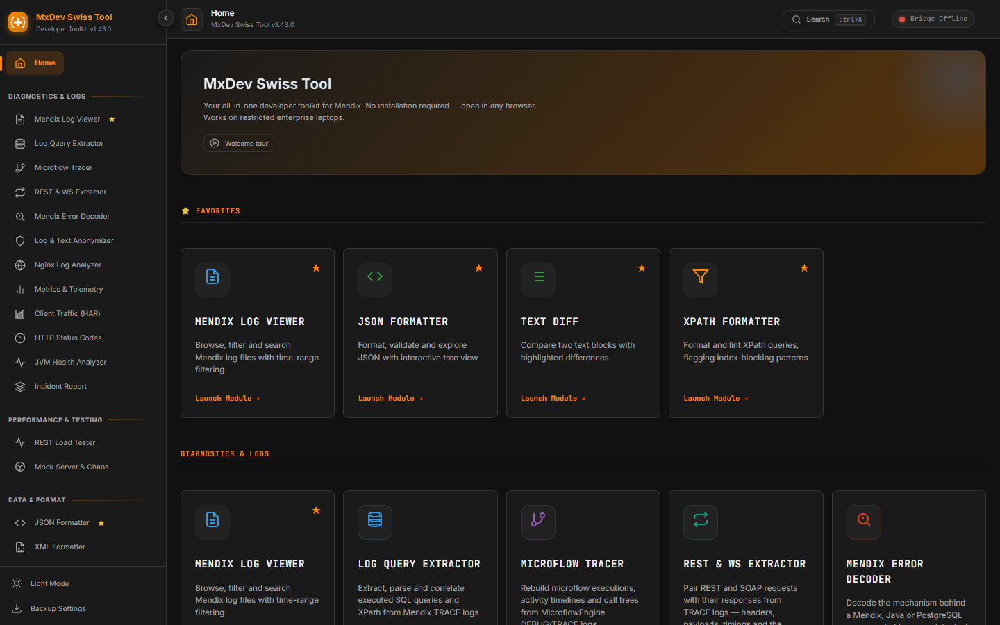

---

## ⚡ Quick Start

1. **Download** the latest `MxDevSwissTool-Release-*.zip` from the [Releases page](https://github.com/RealMecowhy/MxDevSwissTool/releases/latest) — it's listed under **Assets** (don't use the "Source code" links).
2. **Extract** the ZIP to any folder — Desktop or Documents is fine, no admin rights needed.
3. **Run** `Start-MxDevSwissTool.bat` (double-click). The tool opens automatically in your default browser.

No Node.js installed? No problem — the launcher offers to download a portable one for you. If Windows shows a security warning on first launch, choose **More info → Run anyway**. Details and alternatives in [How to Run the Application](#-how-to-run-the-application).

---

## 🛠️ Included Tools & Features

The toolkit is divided into logical categories to assist you across the entire development and diagnostic lifecycle:

### 1. Diagnostics & Logs
* **Mendix Log Viewer**: Tail, search, and filter Mendix logs with time-range filtering, error aggregation, and interactive Sequence/Gantt chart visualization. Reads both Mendix Cloud live logs (`.txt`/`.log`/`.gz`) and Studio Pro CSV exports. An **Insights** tab turns a raw log into a triage board: it scans for known Mendix problem patterns — permission violations, request-state (session) bloat, TaskQueue failures with retry-loop detection, slow-query warnings grouped by statement (the one database signal production gives you without TRACE, with a one-click hand-off to the Log Query Extractor), and per-node error hotspots — and shows one card per issue that actually occurs (never an empty report), each clickable to filter the stream. Alongside the problems it states one *observation*: which log nodes are running at TRACE/DEBUG and what share of the file they account for — usually the answer to "why is this log 60 MB". Observations are counted separately, so a log whose only card is that one still reports as clean. A **Levels Matrix** tab pivots the whole log by log node × severity — one glance shows which logger is producing the errors (nodes are ranked by error volume) and which nodes are running at DEBUG/TRACE; every cell filters the stream to those entries. **Line bookmarks** (the ☆ on any row) pin the key moments of an incident into a bar that survives every filter change — click one to jump straight back, even if the current filter would hide it. A **Correlation Flow** tab lists the correlation IDs the runtime actually recorded — ranked errors-first, then by volume, each labelled with the microflow it belongs to — so you find the request that failed instead of having to know its ID first; clicking one shows its entries in order with its span and error count, and hands the ID over to the stream for the unbounded list. It reads the runtime's own marker (the bracketed token that opens a `MicroflowEngine`/`Plan`/`OQL`/`XPath` message), not any UUID on the line, so a log carrying SAML assertions does not fill the list with identity-provider claim IDs. When a log carries no correlation IDs at all — the normal case at INFO level — it says so and names the log node to raise. It works on ordinary production logs (INFO level and up); no DEBUG/TRACE required.
  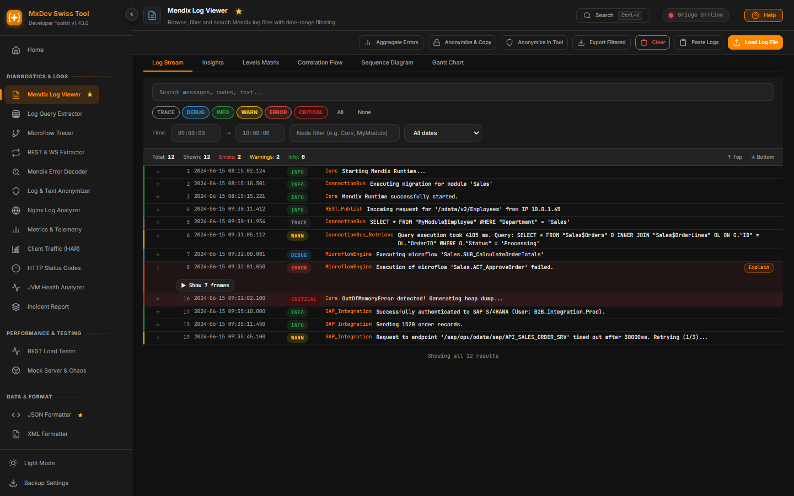
  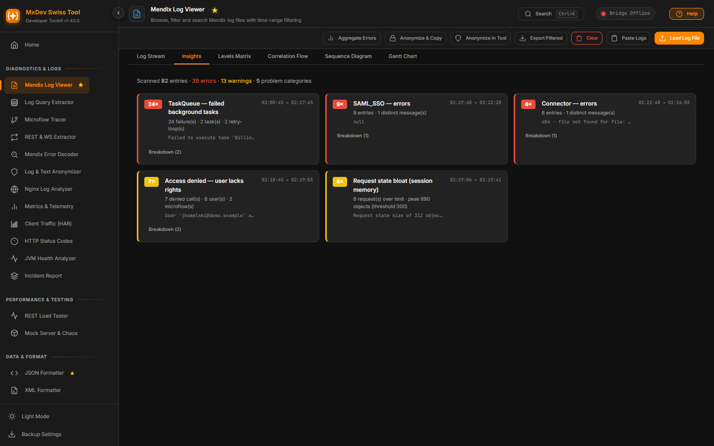
  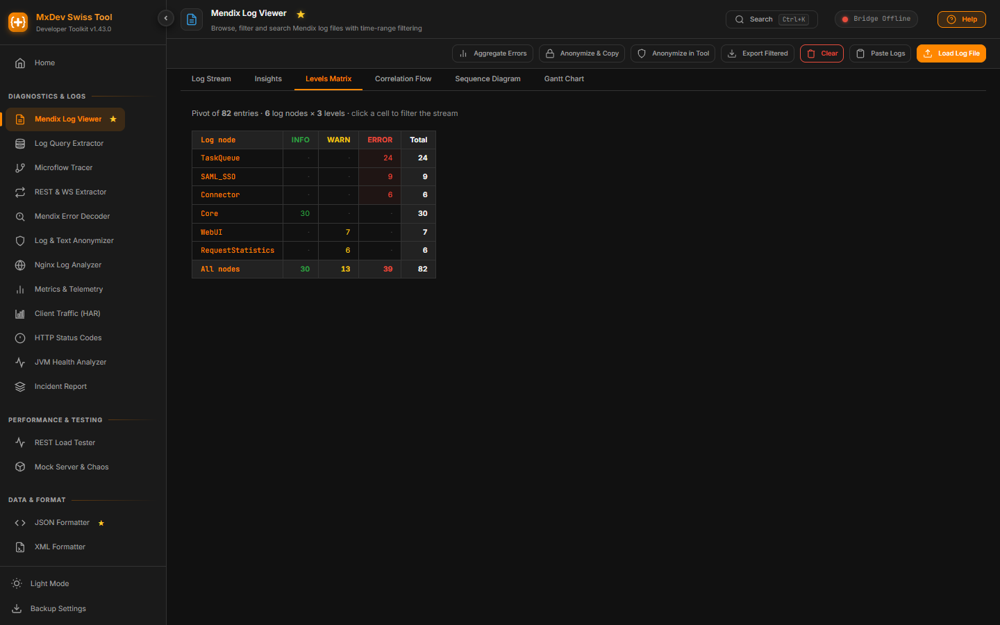
* **Log & Text Anonymizer**: Automatically strip sensitive PII (emails, IPs, UUIDs, custom keywords) from logs before sharing them with support.
* **Log Query Extractor**: Extract, parse, and correlate executed SQL, OQL, and XPath queries from Mendix TRACE logs, complete with parameter binding. Live filter stats (total/avg/slowest time, duplicates), a "Slow only > X ms" filter, and CSV/Markdown export of the filtered list. A **By statement** view folds the executions onto distinct statements — count, total time, average and slowest run — because on a real log the expensive statement is usually the cheap one executed thousands of times, and no per-execution view can show that; totals are summed only from the executions the log actually timed, so a partially-timed statement says so instead of under-reporting. Exports and the Incident Report follow the active view. Also ingests slow-query warnings (`ConnectionBus_Queries`) that Mendix logs at default levels — a production performance signal with zero configuration, picked up from CSV exports and Cloud live logs alike. A shared, single-pass parser reads both formats and runs off the main thread (Web Worker) so even 100 MB+ TRACE logs load without freezing the UI. **Optional live EXPLAIN**: if you have a local/dev PostgreSQL database of the app, connect the read-only *Live database* panel and run `EXPLAIN` on a selected `SELECT` straight from the Query Plan tab — the fresh plan opens in the SQL Explain visualizer. Fully optional and read-only (single `SELECT`, no `ANALYZE`, `READ ONLY` transaction with a statement timeout); without a connection everything works exactly as before.
  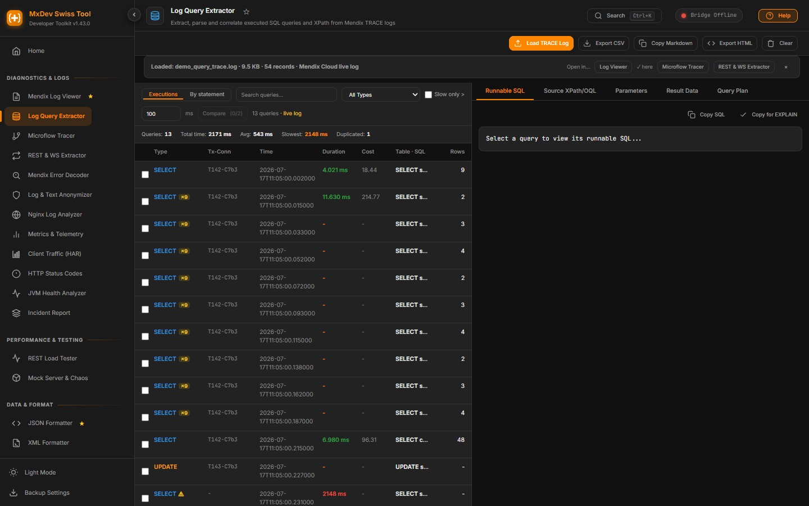
* **Microflow Tracer**: Rebuild microflow executions from `MicroflowEngine` logs — exact durations from DEBUG records, activity-by-activity timelines and sub-microflow call trees from TRACE. Aggregate per-microflow view (calls / total / avg / max) finds hot paths in seconds, recursion gets flagged, a "Queries in window" jump opens the Log Query Extractor filtered to the SQL that ran inside the selected execution, and "Show in Log Viewer" filters the raw log to that execution's correlation ID so you can read everything the runtime logged under the same request — one log file powers all three tools. An **N+1 detector** flags the classic anti-pattern — a database retrieve firing once per row inside a `ListLoop`, whether directly or via a called sub-microflow — with a badge, a stat and a timeline banner naming the repeated retrieve. A **Background** view separates the work the runtime starts on its own (scheduled events, task-queue workers — the runtime gives them a UUID correlation ID, requests get a numeric one) and aggregates it per event: runs, median/max duration, the median interval between starts, a first-half-vs-second-half duration trend, and a flag for runs that **overlapped** a still-open previous run. When the log has no `MicroflowEngine` records at all it falls back to the background failures the log does carry instead of showing an empty table. Reads Studio Pro CSV exports and Mendix Cloud live logs; a real 69 MB production log parses in ~2 s without freezing the UI.
  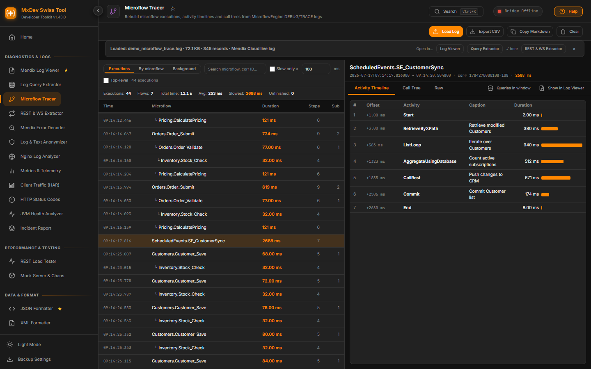
* **REST & WS Extractor**: Rebuild complete integration calls from `REST Consume`, `REST Publish` and `WebServices` TRACE logs — requests paired with their responses (FIFO per endpoint, with an explicit "uncertain" flag when two calls to the same endpoint overlap in flight), including method, URL, status, headers, payloads (auto-prettified JSON/XML) and wire-time duration from timestamp deltas. A **By endpoint** view folds the calls onto endpoints — calls, total time, average, slowest call and errors — because an integration incident is "endpoint X fires 300× on page open" rather than "call #4172 took 900 ms"; durations come only from calls whose response was in the log, so an endpoint with none says so instead of reporting 0 ms. Detects requests that never got a response and marks client-timeout suspects using the logged HTTP-client timeout. With `MicroflowEngine` TRACE present, each outgoing call is anchored to the microflow that made it — "Trace microflow", "SQL in window" and "Show in Log Viewer" cross-links close the full **microflow → REST → SQL** chain across four tools from a single log file — the last one filters the raw log to the call's correlation ID, which is where the reason for a failure or timeout actually lives.
  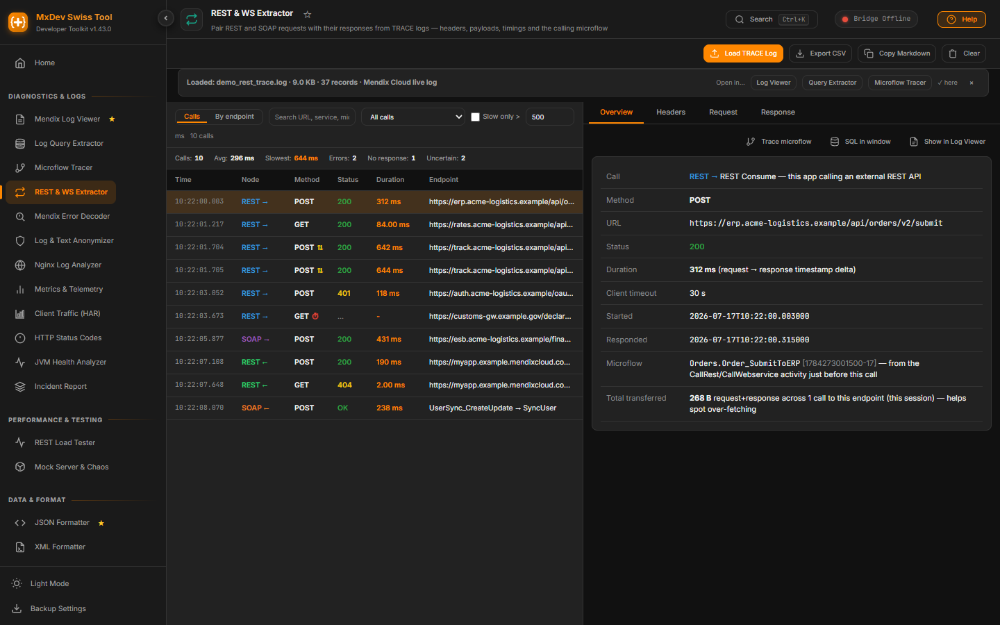
* **Mendix Error Decoder**: Paste a Mendix, Java or PostgreSQL error message or stack trace and get the **mechanism** behind it — decoded, not guessed. For every known signature it matches (unique/foreign-key/not-null constraints, deadlocks, statement timeouts, connection-pool exhaustion, heap/metaspace/GC/thread OOMs, TLS trust failures, socket timeouts, SAML audience/clock-skew/replayed responses, static-file and published-REST 404s (usually internet scanner probes), published REST/SOAP request failures, task-queue failures, request-state growth, missing FileDocuments, autocommitted objects surviving to logout, slow-query warnings, widget XPaths missing a parameter, refused microflow calls, malformed email recipients, import-mapping and XSD validation failures, and more — the platform rules were mined from real production logs rather than from documentation: a first pass over 15 000 error records, then a second pass over **340 863 ERROR/WARNING records from ten production apps** (3.1 GB), which the ruleset now decodes to **89.7% by volume**. What is left unmatched is deliberately left alone — it is each app's own custom log nodes, which generalize to no other Mendix app) it shows three things: *what happened technically* (certain), *typical causes* (an explicit list of hypotheses) and *how to check which one applies* (a diagnostic checklist that links straight to the Log Query Extractor, JVM Health Analyzer and Microflow Tracer). It is a decoder, not a fix advisor: it always shows the pattern it matched so you can judge the fit, and when it does not recognize a message it says so rather than inventing a cause. In the Log Viewer, an ERROR row carries an **Explain** chip *only when the decoder recognizes its signature*, sending the full message here in one click — no chip means no dead-end guess. That chip also carries the row's timestamp and correlation ID, so a check reading "look for two commits around this timestamp" opens the Log Query Extractor already scoped to ±30 s around the error, and the Log Viewer and Microflow Tracer to that correlation ID — instead of dropping you into an unfiltered 60 MB log.
  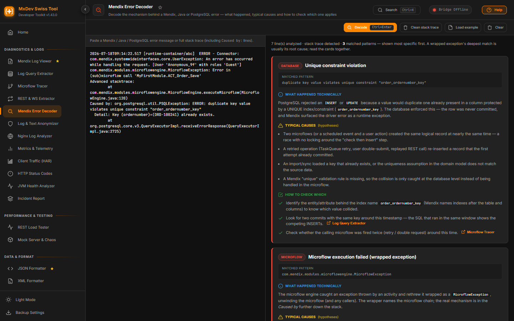
* **Nginx Log Analyzer**: Analyze access logs to identify top IPs, request paths, status codes, and response times, with optional IP geolocation mapping. The slowest-URLs table reports **p95 / p99** latency per endpoint alongside the average, so a slow tail stops hiding behind a healthy mean, and a **"SQL in window"** link on access-log rows jumps to the Log Query Extractor scoped to that request's time window. The 404 table answers **whose fault each 404 is**, because on a public Mendix app they are three unrelated populations: internet scanners probing for software you do not run (~96% of 48 499 real 404s across ten production apps), requests every browser makes on its own (`/apple-touch-icon.png`, `/.well-known/…`), and *your own* broken references — the only fixable group, and 1.6% of that corpus. Yours are listed first and tagged, which in the reference logs surfaced a dead REST endpoint, a missing theme image, a missing webfont and two undeployed widget source maps that had been buried under the noise. **Scanner sources** ranks the IPs behind the probes by hits and by how many *distinct* paths each swept (the top one asked for 4 676), classifying by path and user agent first and then attributing an IP's remaining 404s to the same sweep once it has made three confirmed probes — so a proven scanner's odd path is never reported to you as a broken link.
  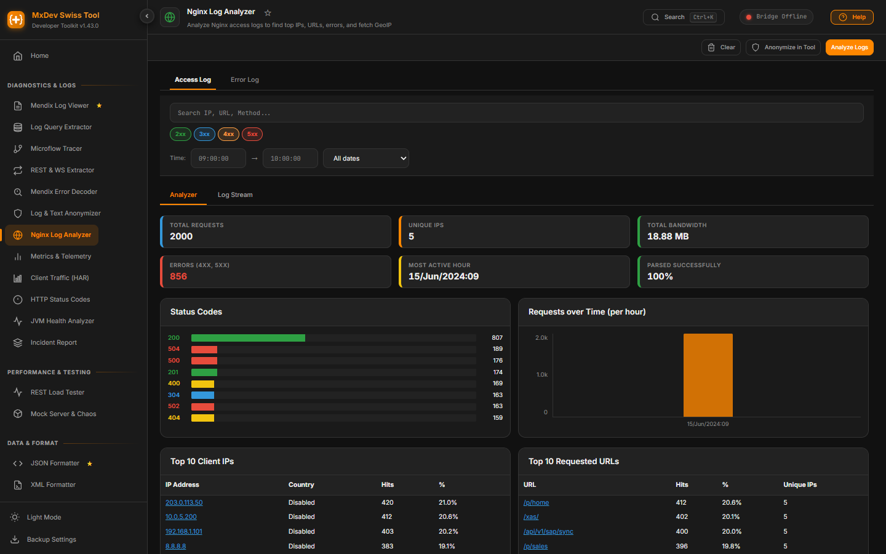
* **Client Traffic Analyzer (HAR)**: Decode a browser HAR into named Mendix operations to spot client-side N+1 patterns, chatty microflows, and oversized responses that raw DevTools can't surface. Covers all three protocols a Mendix app speaks over HTTP: the client protocol (`/xas/`, decoded into microflow names and XPath retrieves) plus published `/rest/` and `/odata/` services, so captures from React or native clients and from integrations are analysed too. Identifiers in REST/OData paths are collapsed to `{id}`, so repeated calls to the same resource group together instead of hiding an N+1 behind a hundred unique-looking URLs.
  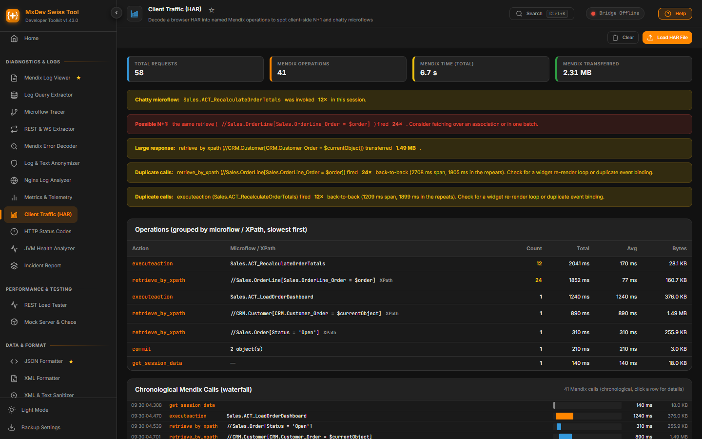
* **Metrics & Telemetry**: Visualize Mendix Prometheus metrics (heap, threads, request rate, database queries) as live dashboards and explore OpenTelemetry traces/logs, locally or from cloud endpoints. Set **configurable threshold alerts** on heap, threads or the database pool — Warning/Danger levels are per-browser, not fixed, since every app has a different baseline — to catch a leak or pool exhaustion as it builds. Includes a sandbox mode for exploring without a running app.
  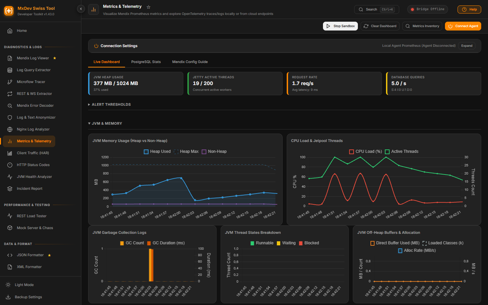
* **JVM Health Analyzer**: Analyze JVM thread dumps, garbage collector logs, and heap histograms to locate blocked threads, diagnose GC pauses, and spot memory leaks.
  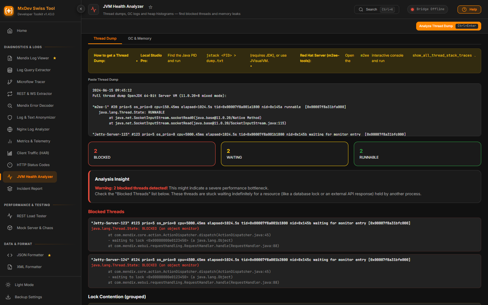
* **Incident Report**: Combine the data already loaded across the diagnostics tools — the current filtered view from each tool (Log Viewer entries, Log Query Extractor SQL, Microflow Tracer executions, REST & WS Extractor calls, Nginx requests, HAR client calls) plus the JVM Health thread-dump summary — into **one self-contained HTML report** for a chosen time window. Each source contributes exactly what it is currently showing, so narrow the view in a tool first and the report follows. Because every section is filtered to the same window, a spike lines up across the browser's own calls, the Nginx 5xx responses, the slow SQL, the failing microflow and the blocked threads in a single file — the report no longer stops at the server boundary that is safe to attach to a ticket (no external resources). Data-driven: only sources that hold data are offered, the row count next to each source is the count *for the selected window* (so you see up front what the window trims away), and anything selected that produced no rows is named as skipped in the summary.
  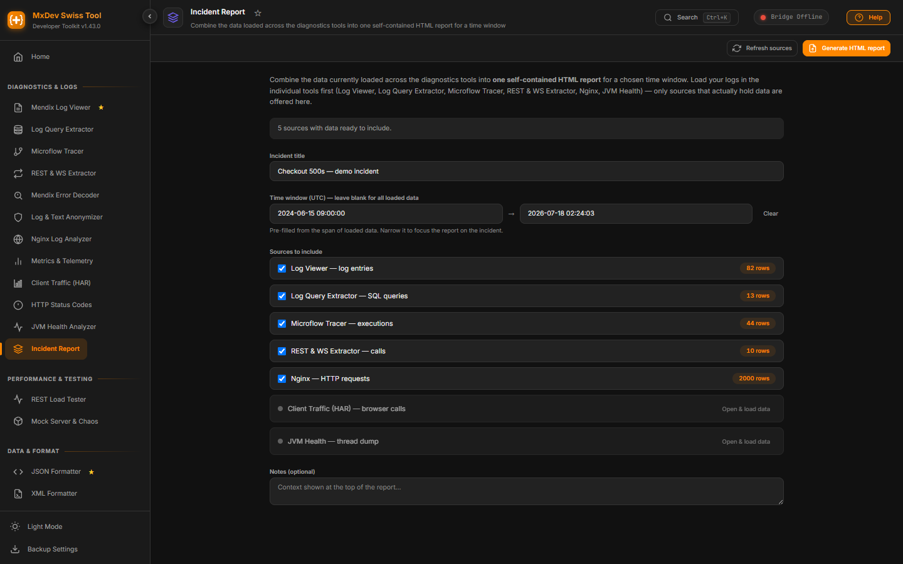
* **HTTP Status Codes**: A searchable status code reference with Mendix-specific context — including the codes a real Mendix access log produces but no generic reference explains: **303** (normally *not* a problem — it is SAML SSO and Deep Link completing, and usually the most common non-200 code you have), **560** (not an IANA code at all but the Mendix runtime's own, returned on `/xas/`, and established by correlation to line up to the millisecond with an `An error has occurred while handling the request` line in the runtime log), and **408**. It also splits **401** into the two unrelated problems that share it: an expired browser session on `/xas/` versus wrong integration credentials on `/odata/`–`/rest/`.

### 2. Performance & Testing
* **REST Load Tester**: Load-test Mendix HTTP/REST endpoints with real-time latency tracking and statistics (min/avg/max, p50/p95/p99). Run a fixed batch or an open-ended test, and drag the thread slider **while traffic flows** — the throughput chart plots requests/s against thread count, so the point where the app stops scaling is visible as it happens. A built-in **Message Factory** turns one pasted example message (JSON or XML) into a different message for every request — generators are guessed from the field names, fields can be pinned, made unique, or copied from one another so the payload stays internally consistent, and `{placeholders}` in the URL vary the path and query for GET/DELETE operations. Preview what it will send before you send it; the same seed replays the same sequence. Fastest start: paste your service's **`openapi.json`** URL — the bridge fetches it (published Mendix specs send no CORS headers, so the browser can't), and picking an operation fills the method, URL, headers and a schema-derived sample body straight into the Message Factory. Reads OpenAPI 3 and Swagger 2 JSON. **Authentication** is a field, not a hand-written header: pick *Basic* or *Bearer* and both engines send the identical `Authorization` header — including a non-ASCII password, which `btoa()` cannot encode. The same credentials are forwarded to a protected `openapi.json`. Presets remember the username, never the secret. When a run ends, a **Summary** states it in one paste-able paragraph — status breakdown, and, if you moved the thread slider, a **throughput-per-thread-count table** that names the app's knee. A run that was rejected end-to-end says so, because a 401 is fast and would otherwise read as an excellent result.
* **Mock Server & Chaos Engineering**: Simulate external REST endpoints with configurable mock responses, artificial latency, and injected connection errors (5xx, timeouts).
  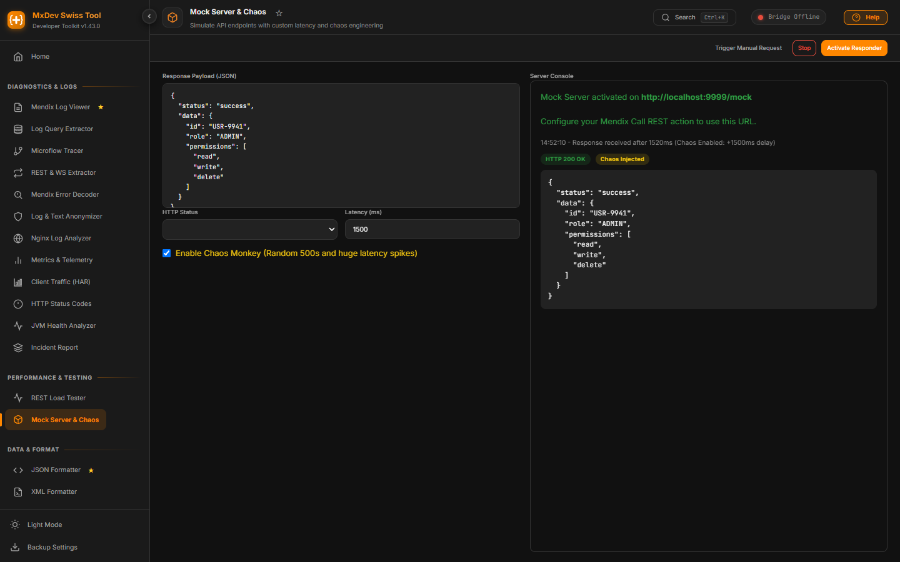
* **Data Factory**: A mock-data generator driven by a **four-step wizard** — *Source → Select → Columns & types → Output*. Pick a source: **Manual** (define columns by hand, optionally pasting a `CREATE TABLE` script to pre-fill them — nothing is executed, only the column list is read), **One table from the database** (read one Mendix entity's real attributes over an optional read-only connection), or **Multiple linked tables** (pick several related entities and generate them together). Each column's *generator* is inferred from its name and type — `EmailAddress` becomes an e-mail, `Price` a decimal, `city_id` stays an integer — and is **parametrized**: a Country picks its region, a Date its from/to range, a code its pattern, a Sequence its prefix & counter, an Enum/Custom list its values with optional weights. Any column can carry an **empty %** (leave a share of rows NULL) and a **unique** guard (auto-set for columns with a UNIQUE index, so a duplicate never aborts the transaction); an enum's real values can be **sniffed** straight from the live column. Output is **CSV / JSON / XML** for a single table, or a downloadable `.sql` `INSERT` script — for a relational set the foreign keys follow a realistic distribution (a few parents get many children, most a handful, some none), inserts are ordered parents-before-children, and each value is clamped to its column's real length/type. The runtime `id` is emitted only for SQL. The Bridge writes nothing: run the script against a dev/test database with the app stopped — it opens a transaction and stops before `COMMIT`, so you review the rows and commit (or roll back) yourself.
  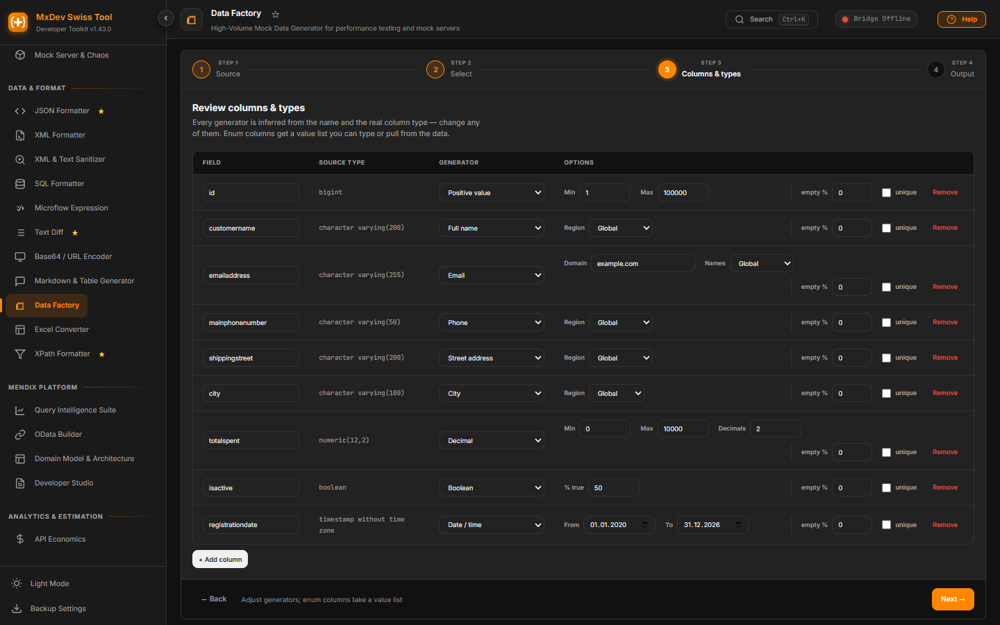

### 3. Data & Formatting
* **JSON / XML Formatters**: Format, validate, and explore payloads with interactive tree views.
  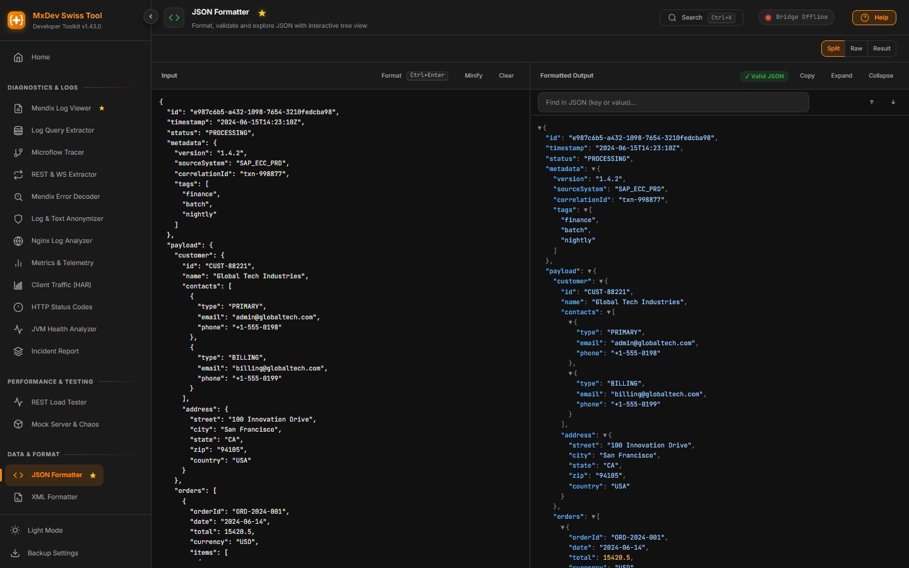
* **SQL Formatter**: Format and highlight complex ORM-generated database queries — keywords, functions, operators and column paths each coloured, with hover bracket-matching and an editable output view — plus configurable indent (2/4) and keyword casing. **Analyze in Query Intelligence** copies a ready-to-run `EXPLAIN ANALYZE` for the query and jumps straight to the Explain tab.
* **Microflow Expression Formatter**: Pretty-print a one-line Mendix Expression editor value into indented, syntax-highlighted `if/then/else` and arithmetic — nested `if`s read as nested blocks instead of a run-on line. Space-stripped paste is re-spaced automatically; hover an `if` to highlight its matching `else`, or a bracket to highlight its partner; edit the result before copying.
* **Base64 / URL Encoder**: Encode and decode strings and HTML entities locally.
* **XML & Text Sanitizer**: Detect and clean hidden control characters, zero-width spaces, Mojibake, escaped references to invalid XML 1.0 characters (like `&#14;`), and invisible Private Use Area codepoints.
* **XPath Formatter (Linter)**: Format and syntax-highlight Mendix XPath constraints (with hover bracket-matching and an editable output view) and lint them for index-blocking patterns before they hit the database.
  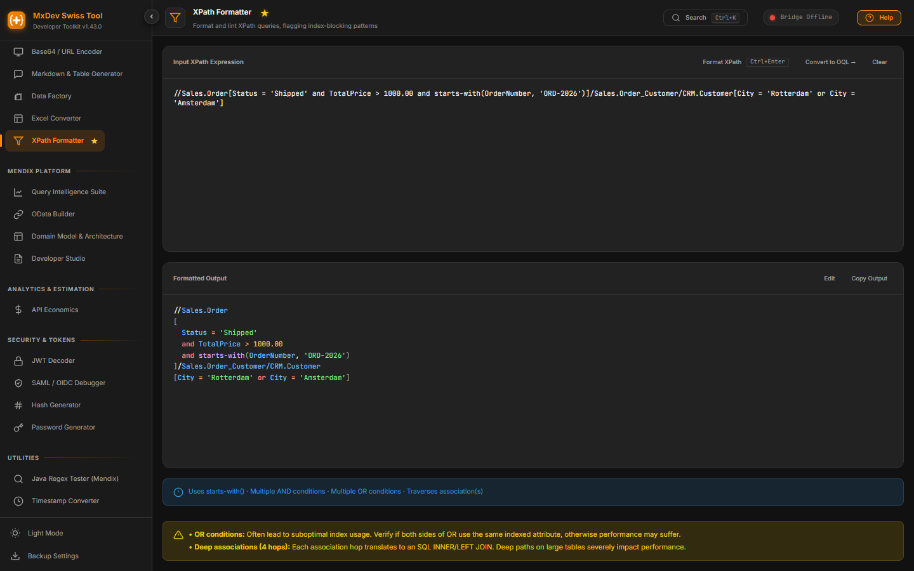
* **Text Diff**: Compare two text blocks or code side-by-side with differences highlighted.
  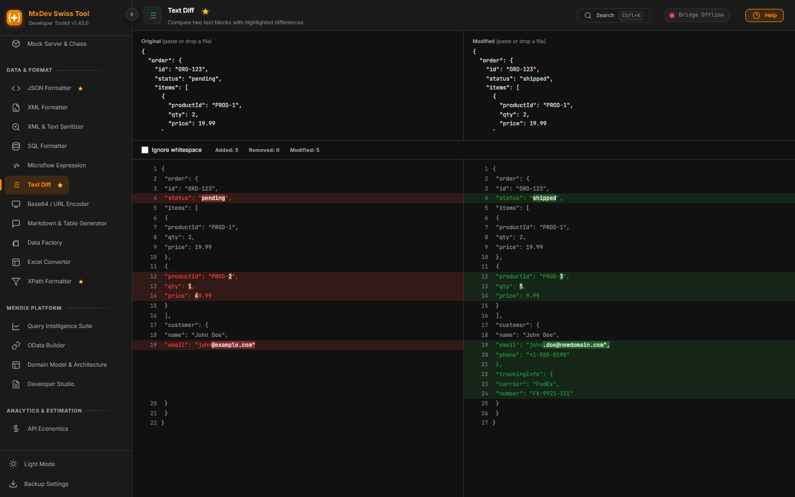
* **Markdown Editor & Table Generator**: Write module documentation with a live HTML preview — drop a `.md` file straight onto the editor to load it. The table generator turns a range pasted from Excel, Google Sheets, or a CSV into a ready Markdown table, with per-column alignment and no hand-typed pipes.
* **Excel Converter**: Turn an `.xlsx` workbook — the whole file or one selected sheet — into JSON or CSV, without the Excel → *Save As CSV* → fix-the-separator-and-encoding round trip. Reads the workbook in the browser with no library at all (an `.xlsx` is a ZIP of XML, unpacked with the browser's own `DecompressionStream`), so nothing is uploaded. Every sheet is listed with its row and column counts, hidden sheets included and marked. Output is JSON as an array of objects (first row becomes the keys), JSON as raw rows, or CSV with a choice of delimiter — pick the semicolon for a Polish or German Excel, where a comma-separated file otherwise opens as one mashed column — and a UTF-8 BOM that is on by default, because without it Excel mangles every accented character. Dates are read rather than guessed: Excel stores them as plain numbers and only the cell format makes them dates, so the tool reads the format table and emits ISO 8601 (with a switch to keep the raw serial number). Formulas arrive as their last calculated value, merged ranges keep the value in the top-left cell and say how many ranges a sheet has, blank header cells become their column letter and duplicate headers get a numbered suffix rather than silently overwriting each other. The legacy binary `.xls` format is not supported and is named as such, with the fix, instead of failing as a parse error.
  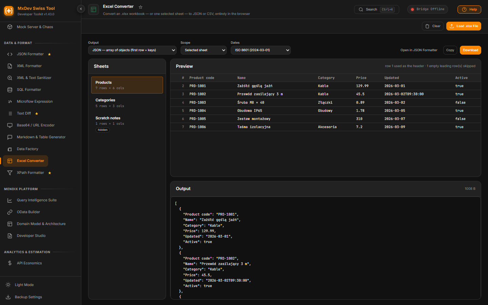

### 4. Mendix Platform Utilities
* **Query Intelligence Suite**: A consolidated query workbench — OQL formatter, OQL ↔ SQL translator, PostgreSQL EXPLAIN plan visualizer with index suggestions (paste a plan, or optionally run EXPLAIN live against a connected read-only local/dev database), a schema visualizer that draws entities and associations from an OQL query, and an **Index Advisor** that reads the catalogs of a connected database to report duplicate, redundant, invalid and never-scanned indexes plus tables dominated by sequential scans. The advisor is careful about what statistics can actually prove: index usage counters restart at zero on a restored dump, so when the window is too thin it says so and withholds the usage findings instead of telling you to drop 600 healthy indexes — structural findings, read from the catalog shape, hold either way. Findings for Mendix-managed tables note that indexes declared on an entity are recreated on every deploy, so the real change belongs in Studio Pro rather than in SQL. With a domain model loaded (Domain Model & Architecture → *Load model from database*), the SQL-facing tools speak your names rather than PostgreSQL's: the advisor's cards, the Explain suggestions and the Query Extractor's row labels say `eShop.OrderLine` instead of `eshop$orderline`. Progressive enrichment — with no model loaded nothing changes.
  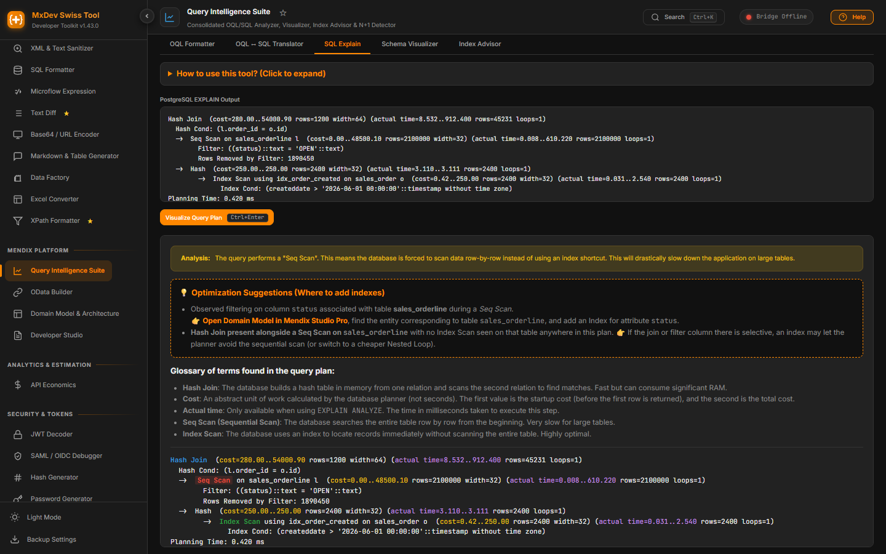
  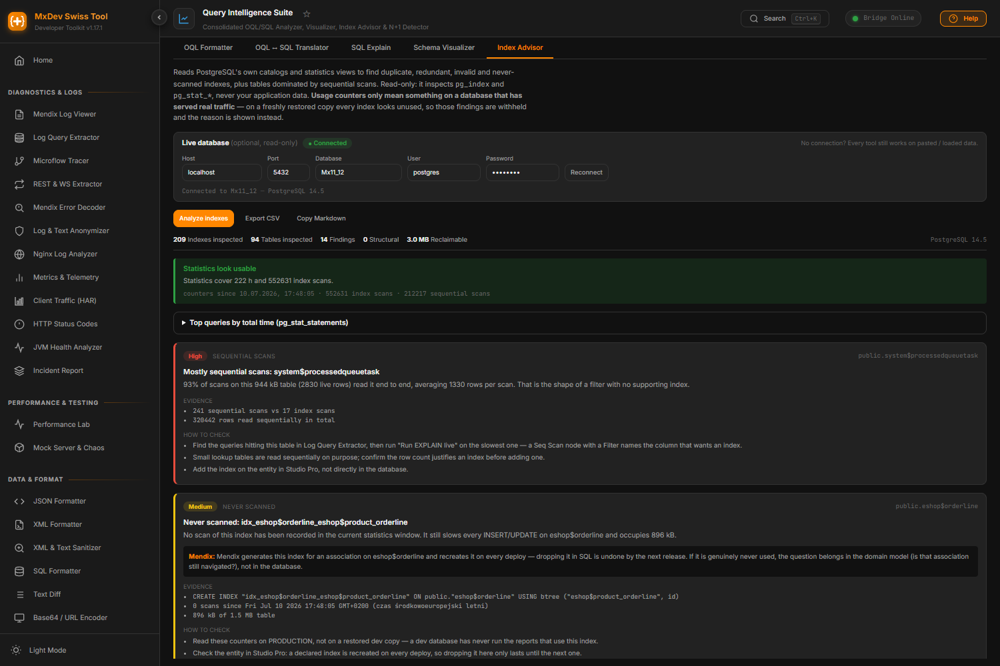
* **OData Query Builder**: Build correct OData v3/v4 queries for Published OData Services without hand-crafting URLs.
* **Domain Model & Architecture Visualizer**: Generate Mermaid.js class diagrams from Domain Model JSON schemas or pseudocode — or **load the domain model straight from a running Mendix database** (optional, read-only). Mendix keeps its own model metadata in `mendixsystem$entity` / `$attribute` / `$association`, so the database can describe entities, attributes, inheritance and associations without Studio Pro or the `.mpr` file, on both Mendix 9 and 11. Association cardinality is read from real `UNIQUE` indexes rather than assumed, so 1-1 is distinguished from 1-* and *-* from 1-*. Because a real application is unreadable as a single diagram, you pick which modules to draw. The diagram renders at its natural size and the panel is a proper viewport: **scroll to zoom** (towards the cursor), **drag to pan**, plus **Fit / 1:1** buttons and a live zoom percentage — a model wider than the panel opens fitted, so you see the whole shape before zooming into a corner of it. Switching the light/dark theme redraws the diagram in the matching palette instead of leaving it in the other theme's colours. Without a database the tool behaves exactly as before.
  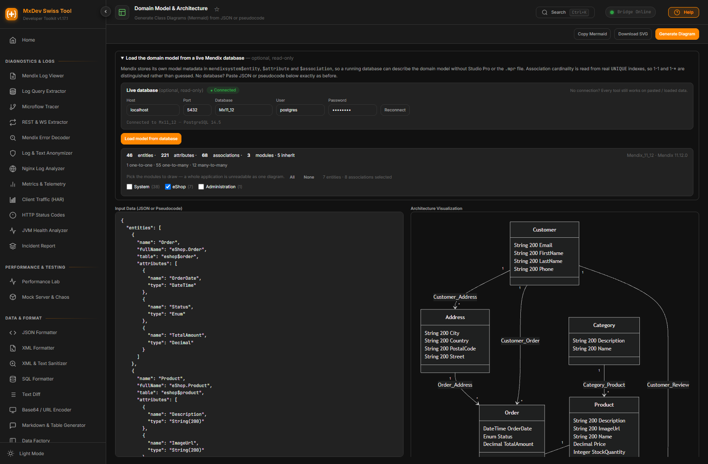
* **Developer Studio**: A dashboard for your locally running Studio Pro project via the Observability Bridge — configuration, user roles, request handlers, scheduled events, constants, and client bundle size.
* **API Economics**: Analyze JSON payloads to cut response size and spot redundant fields.

### 5. Security & Utilities
* **JWT Decoder**: Inspect JWT tokens securely without transmitting them externally, with hover explanations for standard claims. Verify **RS256/ES256 signatures** against a pasted public key (PEM or JWK/JWKS) via native WebCrypto — without a key the signature is shown as unverified, never a false "OK". Paste a second token to compare claims side-by-side, e.g. before/after a refresh.
  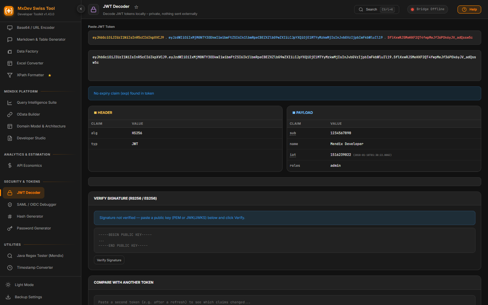
* **SAML / OIDC Debugger**: Decode SAML responses/requests (Base64, URL-encoded or DEFLATE-compressed) and OIDC id_tokens locally to debug SSO integrations — inspect assertions, claims, and validity windows without pasting tokens online.
  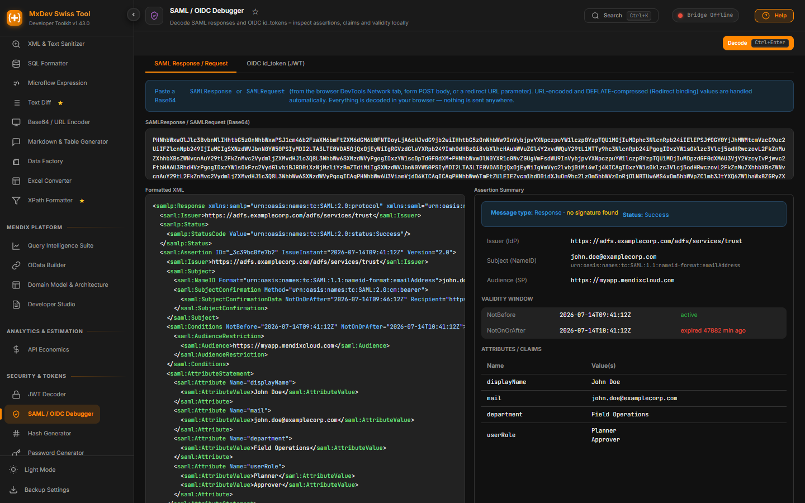
* **Hash / Password Generators**: Generate strong passwords and cryptographic hashes (SHA-256, SHA-512) locally.
* **Java Regex Tester (Mendix)**: Evaluate regular expressions against the Java regex engine — exactly how Mendix validates them at runtime.
* **Timestamp Converter**: Convert between Unix epochs, ISO 8601, and local timezone formats.

---

## 🧭 Getting Around

* **Welcome tour**: on the very first launch a short onboarding modal introduces the essentials below; reopen it anytime via the **Welcome tour** button on the Home screen.
* **Built-in help**: every tool has a **Help** button in the top bar explaining what it does and, where relevant, how to extract the input data (e.g. a HAR from browser DevTools or TRACE logs from Mendix).
* **Favorites**: click the ☆ star next to a tool's name (or on its Home card) to pin it to the top of the Home screen.
* **Command palette**: press **Ctrl+K** to jump to any tool by name, or run a global **action** — *Export current view* and *Load file into…* act on whichever tool is active.
* **Keyboard shortcuts**: **Ctrl+K** opens the command palette, **Ctrl+Enter** runs the primary action of the active tool (buttons that support it show the hint on the button itself), **Esc** closes the palette or any open dialog.
* **Keyboard and screen readers**: every dialog traps Tab while it is open and hands focus back to whatever opened it on close; sortable column headers and the level/status filter chips are reachable with Tab and activated with Enter or Space, announcing their pressed state. Long parses announce their progress instead of changing silently. The theme follows your operating system's light/dark preference until you pick one yourself, and the OS "reduce motion" setting is respected throughout.
* **Backup Settings**: the sidebar footer saves your favourites, theme, sidebar state and every per-tool setting to one JSON file, and restores them on another browser or machine. Settings only — no log, HAR or database content is ever stored, so none of it is in the file.
* **Resume where you left off**: reopening the app returns you to the tool you used last. A `#tool=…` link always wins, so bookmarks and shared deep links still land where they point.
* **Data Hub — load a log once, use it everywhere**: the four log tools (Log Viewer, Log Query Extractor, Microflow Tracer, REST & WS Extractor) share whatever file you last loaded. A bar above the view reports *Loaded: file · N records · format* and offers **Open in…** buttons for the other three — one click hands the same file over instead of dragging a 60 MB log into each tool in turn, and a ✓ marks the ones that already have it. It is also the only route for a gzipped `.gz` Cloud download: the Log Viewer unpacks it and shares the decompressed text with tools that cannot read `.gz` themselves. Nothing is loaded? Then no bar appears at all.

---

## 🔒 Data Privacy First

This application is built with a strict **local-first** philosophy:
* All formatters, generators, decoders, and parsers execute completely within your browser.
* No data is uploaded to external servers.
* The local Node.js bridge server only acts as a read-only reader for local log files and database details on your machine.

---

## 🚀 How to Run the Application

**First time here?** Download and extract the release ZIP first — see [Quick Start](#-quick-start) at the top.

### 1. Default (Recommended)
Simply double-click the `Start-MxDevSwissTool.bat` file in the project root directory. This starts the local bridge server and automatically launches the tool UI in your default browser.

**No Node.js on your machine?** Not a problem — the launcher detects it and offers to download a portable `node.exe` (official nodejs.org binary, ~90 MB) into a `runtime` folder next to the launcher. No installation and **no admin rights** required, which makes it work on locked-down corporate laptops. If a proxy blocks the download, the launcher prints a short manual fallback: save [node.exe](https://nodejs.org/dist/latest-v24.x/win-x64/node.exe) into the `runtime` folder yourself.

### 2. Manual Command Line
If running `.bat` files is blocked by security policies in your corporate environment (requires Node.js available on `PATH`):
1. Open a terminal in the project directory.
2. Start the bridge server using Node.js:
   ```bash
   npm start
   ```
   *Alternatively, if npm is not configured, run directly:*
   ```bash
   node server/mendix-observability-bridge.js
   ```
3. Open your browser and navigate to: [http://localhost:9999/](http://localhost:9999/)

### 3. Optional: Live PostgreSQL Metrics
The bridge itself starts with **zero npm dependencies** — no `npm install` needed. Only the live PostgreSQL metrics feature requires the `pg` module. To enable it, run this once in the project directory and restart the bridge:
```bash
npm install pg
```
Everything else works without it.

---

## 🔄 Updating

Shortly after startup the tool checks [GitHub Releases](https://github.com/RealMecowhy/MxDevSwissTool/releases) for a newer version (a single anonymous API call; silent when offline or blocked by a proxy). When one exists, a popup shows the release notes of everything you missed and offers two paths:

* **Update now** — the bridge downloads the release ZIP, unpacks it, replaces its own files via a small updater window and restarts. The UI reloads automatically on the new version.
* **Download ZIP** — manual fallback for locked-down machines: grab the ZIP and unpack it over the tool folder, then start the launcher again.

You can also snooze the reminder for a day or skip a version entirely.

The full history is in [CHANGELOG.md](CHANGELOG.md) — including the 21 versions that shipped as commits and were never published as releases, which the Releases page cannot show you.

**Your local data is safe either way:** favorites, presets and theme live in your browser's storage (not in the tool folder), and the update never touches the `runtime/` folder with portable Node.js. Because that storage belongs to the browser profile, clearing site data or moving to another machine still loses it — use **Backup Settings** in the sidebar footer to carry it across.

---

## 📴 Offline Use

The toolkit is a Progressive Web App. On first load a service worker caches the entire interface — every tool module, the styles and the in-app help — so the whole toolkit keeps working with no network, including tools you have never opened before.

**Startup is deliberately light.** The two heavy rendering libraries — the diagram renderer (3.5 MB, used by *Domain Model & Architecture*) and the charting library (200 KB, used by *Metrics & Telemetry* and the *Performance Lab*) — are no longer part of the startup payload; they are fetched the first time a tool actually draws something. The page that opens on launch went from 5.5 MB to 1.9 MB. Offline is unaffected: the service worker still caches both in the background, so those tools work without a network too.

* **Install it as an app**: in Chrome or Edge, use the install icon in the address bar (or ⋮ → *Cast, save and share* → *Install page as app*). It then opens in its own window without browser chrome and starts from the same local files.
* **What still needs the bridge**: anything that reads your machine or the network — live logs, the Developer Studio, Live DB features, the Mock Server, the REST Load Tester's server engine and the update check. Every offline-capable tool (all the formatters, decoders, log analysers and generators) works on files you drop in.
* **After an update**: a new version's assets replace the old ones automatically. If you were mid-session, a notification asks you to reload so the running page and the cached files match.

---

## 📁 Directory Structure

* [public/](public) - Web frontend application interface (HTML, CSS, JS).
* [server/](server) - Local Node.js bridge server (`mendix-observability-bridge.js`).
* [scripts/](scripts) - Build and maintain utility scripts.
* `Start-MxDevSwissTool.bat` - Quick launch script for Windows. Creates an optional `runtime/` folder if you let it download portable Node.js.
